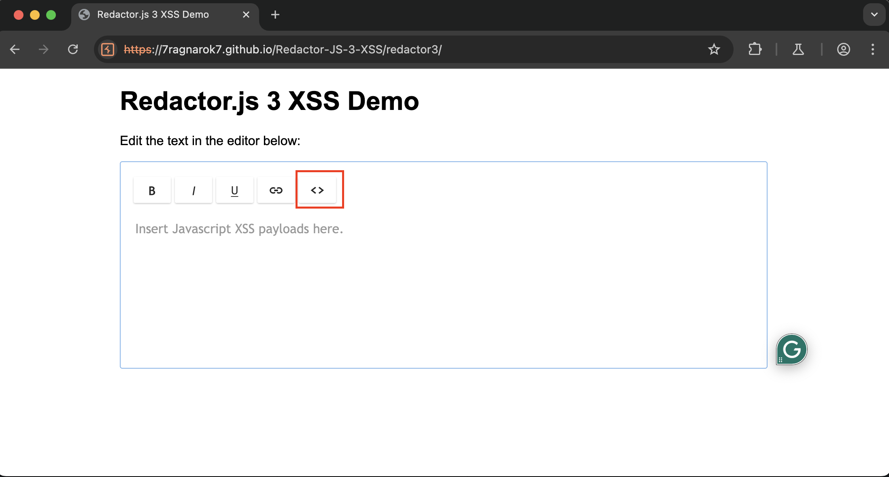
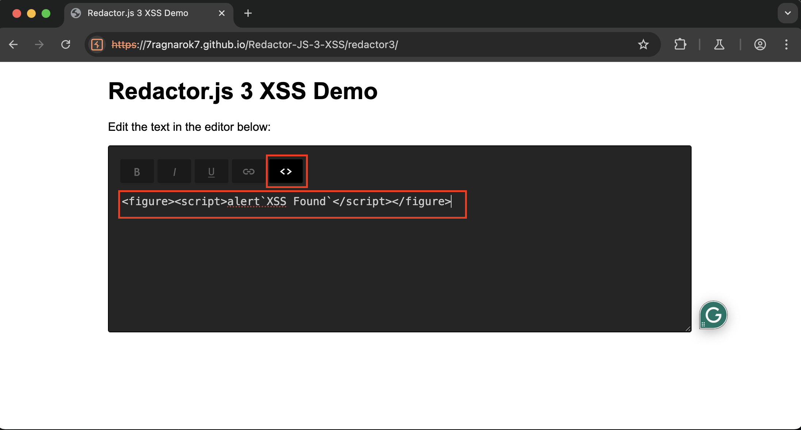
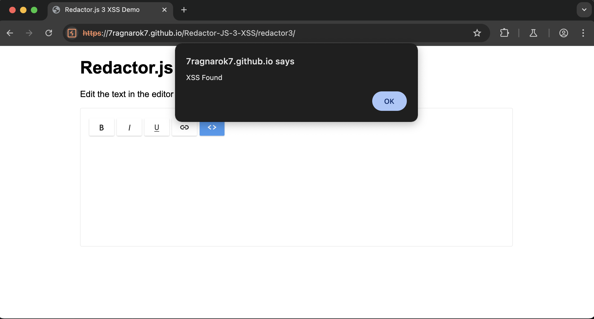

# Redactor JS 3 XSS
This repository documents the vulnerability details and exploit for [Redactror JS](https://imperavi.com/redactor/) 3 and prior versions.

## Metrics
- [CWE-79: Improper Neutralization of Input During Web Page Generation ('Cross-site Scripting')](https://cwe.mitre.org/data/definitions/79.html)
- [CVSS: 6.1 (MEDIUM)](https://nvd.nist.gov/vuln-metrics/cvss/v3-calculator?vector=AV:N/AC:L/PR:N/UI:R/S:C/C:L/I:L/A:N&version=3.1)

## Vulnerability Overview
This Proof of Concept (POC) demonstrates the exploitation of an XSS vulnerability discovered by me recently in the [Redactror JS](https://imperavi.com/redactor/)  WYSIWYG editor, which affects all versions of Redactor JS 3 and its prior versions. The flaw allows JavaScript execution by embedding a `<script>` tag inside a `<figure>` tag within the editor, which the library fails to sanitize.

## Prerequisites
1. **Redactor JS (version <= 3.\*.\*)**: https://github.com/7Ragnarok7/Redactor-JS-3-XSS/tree/main/docs/redactor3/

## Reproduction Steps
This vulnerability can be tested using the pre-configured Redactor JS 3 instance present [here](https://7ragnarok7.github.io/Redactor-JS-3-XSS/).

1. **Switch to Source/HTML mode and insert Payload**:
   - Open the Redactor JS instance and click on the "HTML" icon.
   - Insert the following payload in the text area:

     ```html
     <figure><script>alert`XSS Found`</script></figure>
     ```
     
     
     
     
 2. **Switch to WYSIWYG Mode**:
   - Click on the "HTML" icon again to switch back to the WYSIWYG mode.
   - Observe the XSS payload getting triggered.
     
     
   
## Advisory
   
## Important Links
- https://imperavi.com/redactor/
- https://imperavi.com/redactor/examples/initialization/base-example/
- https://7ragnarok7.github.io/Redactor-JS-3-XSS/

